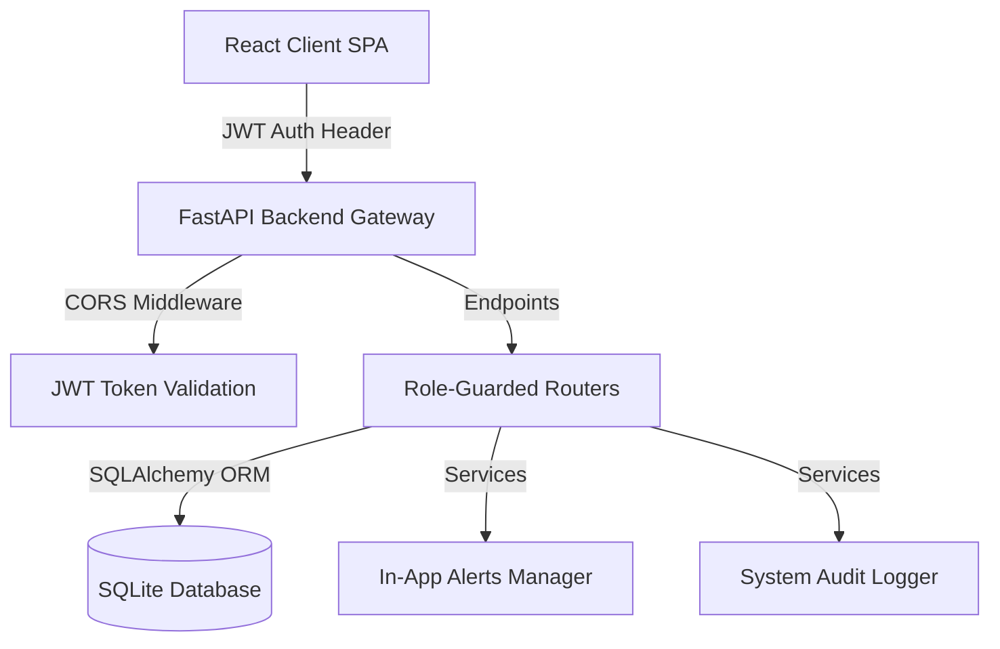
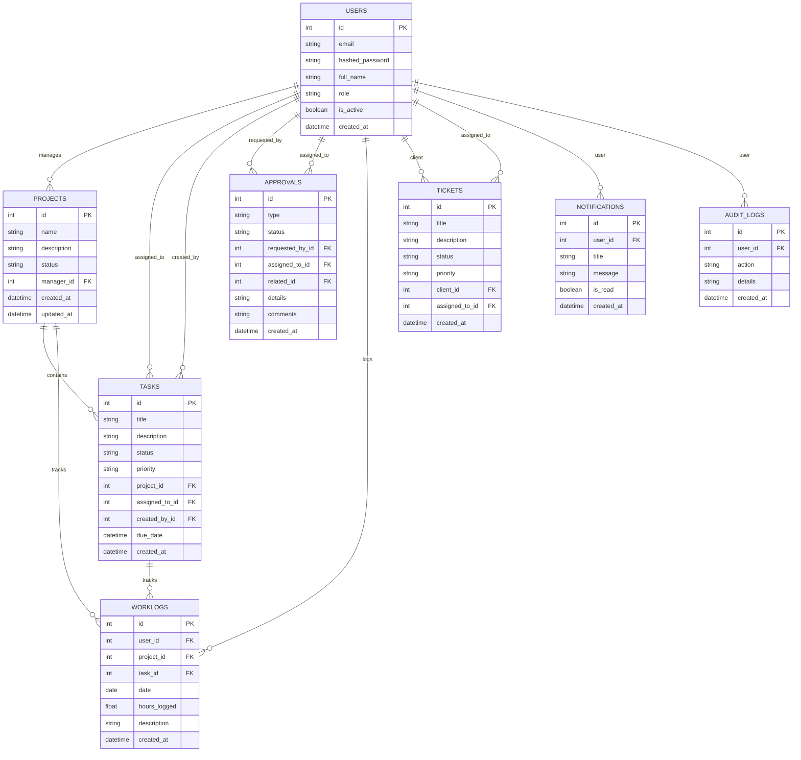

# SWATS - Smart Workflow Automation & Tracking System

SWATS is a production-grade workflow automation, performance tracking, and support ticketing hub built with Python FastAPI, SQLite (SQLAlchemy), and a React + Vite (TypeScript) frontend styled with custom glassmorphic Vanilla CSS.

---

## Preset Login Accounts
On the login screen, you can click the **Quick Preset Pills** to automatically log in as any of the roles with pre-seeded database metrics:

| Role | Username | Password | Full Name | Primary Dashboard Views |
| :--- | :--- | :--- | :--- | :--- |
| **Admin** | `admin@swats.com` | `admin123` | Amit Sharma | Security Activity Audit Trail, Global Productivity, Project assignments |
| **Manager** | `manager@swats.com` | `manager123` | Rohan Verma | Leave Review triggers, Ticket promotions, Team Workloads |
| **Employee** | `employee@swats.com` | `employee123` | Kunal Sen | Daily hour logs, Task progression board, Leave Request form |
| **Client** | `client@swats.com` | `client123` | Preeti Patel | Support tickets desk, Deliverables tracking |

---

## System Architecture



## Database Entity-Relationship (ER) Diagram



- **Backend:** Python + FastAPI + Uvicorn + SQLAlchemy
- **Frontend:** React + Vite + TypeScript + Lucide Icons + Custom HSL Stylesheet
- **Automation Triggers:**
  - When an Employee logs work on a task, it updates project-wide productivity charts instantly.
  - When an Employee completes a task, they submit a **Task Completion Approval** to their Manager.
  - When the Manager approves the task completion request, the system **automatically** transitions the task's state to `completed`.
  - When a Client submits a support ticket, all Managers receive instant in-app notification alerts.

---

## Quick Start Guide

You will need two terminals running to launch the dev servers:

### 1. Start the Backend API (FastAPI)
Run the following from the root workspace directory (`e:/my-applications/SWATS`):
```powershell
# Activate environment and run uvicorn
.\venv\Scripts\python.exe -m uvicorn backend.app.main:app --port 8000 --reload
```
*Note: Seeding script runs automatically on the first startup to seed all user roles and logs.*

### 2. Start the Frontend (Vite + React)
Open a new terminal window, navigate to the `frontend` folder, and run:
```powershell
cd frontend
npm run dev
```
Open [http://localhost:5173](http://localhost:5173) in your browser to evaluate!

---

## Running Verification Tests
To run the automated authentication and security test suite:
```powershell
.\venv\Scripts\python.exe -m unittest backend/app/tests/test_auth.py
```
